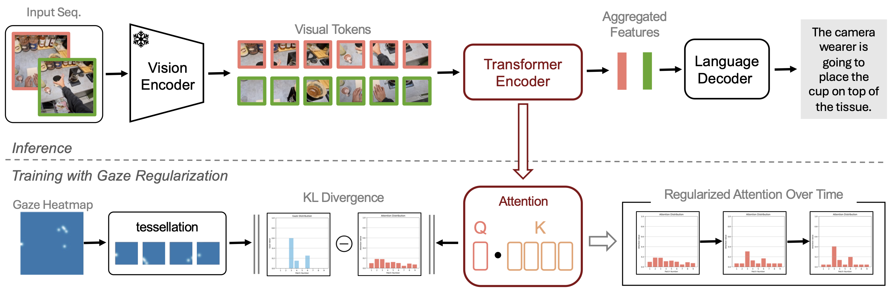

# Gaze-VLM
Repository for NeurIPS 2025 Paper "Gaze-VLM: Bridging Gaze and VLMs via Attention Regularization for Egocentric Understanding"

## 📖 Introduction

We introduce a gaze-regularized training framework that enhances vision-language models for egocentric understanding. Our approach is simple yet effective: during training, we guide the model's attention to focus on the same image regions that humans naturally look at, while maintaining standard inference without any gaze requirement

As shown in the figure, our method works as follows:
During inference (top), the process is straightforward: egocentric video frames pass through a standard vision-language model to generate descriptive text, with no gaze data needed.
During training (bottom), we add gaze regularization: we convert human gaze heatmaps into spatial distributions and align the model's internal attention patterns with these human attention maps using a KL-divergence loss. This teaches the model to "look where humans look" without changing its architecture.
The key advantage is that once trained, our model operates like any standard vision-language model—it doesn't require gaze input during deployment yet produces more human-like and grounded visual understanding for egocentric tasks

The link to the paper (through ArXiv) will be uploaded soon.....

## Road map and Check-List 
1) Dataset Instructions and how to recreate - with code
2) Code for model and instructions

## 🚀 Installation 
Instructions and code coming soon ......

## Contact
If you have any questions, please feel to contact us at apani3@connect dot hku dot hk with the subject "Gaze-VLM" and we will try to get back to you as soon as possible. We are open to suggestions and collaborations. 
